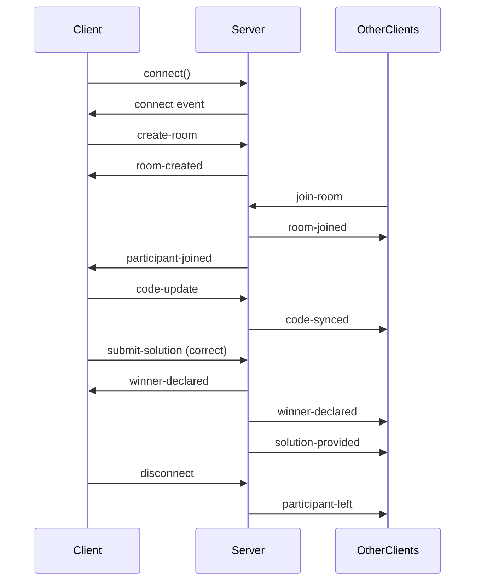

# 🔌 Socket.IO Event Reference

## Real-Time Competitive Coding Events

### Client → Server Events

#### `create-room`
**Purpose**: Create a new competition room
```javascript
socket.emit('create-room', {
  problemId: 1,
  userId: 'user_xyz',
  userName: 'John Doe'
});
```
**Response**: `room-created` event

---

#### `join-room`
**Purpose**: Join an existing competition room
```javascript
socket.emit('join-room', {
  roomId: 'ABC123',
  userId: 'user_xyz',
  userName: 'John Doe'
});
```
**Response**: `room-joined` event
**Broadcast**: `participant-joined` to all in room

---

#### `code-update`
**Purpose**: Sync code changes to all participants
```javascript
socket.emit('code-update', {
  roomId: 'ABC123',
  code: 'function twoSum(nums, target) {...}',
  userId: 'user_xyz'
});
```
**Broadcast**: `code-synced` to others (not sender)

---

#### `submit-solution`
**Purpose**: Submit code for testing and competition
```javascript
socket.emit('submit-solution', {
  roomId: 'ABC123',
  userId: 'user_xyz',
  code: 'function twoSum(nums, target) {...}',
  language: 'javascript',
  testResults: {
    allPassed: true,
    results: [...]
  }
});
```
**Triggers**: `winner-declared` (if first) or `solution-provided` (if not)
**Broadcast**: `submission-update` to all

---

#### `send-message`
**Purpose**: Send chat message to room
```javascript
socket.emit('send-message', {
  roomId: 'ABC123',
  userId: 'user_xyz',
  userName: 'John Doe',
  message: 'Good luck everyone!'
});
```
**Broadcast**: `new-message` to all in room

---

#### `request-solution`
**Purpose**: Request winner's solution (if lost)
```javascript
socket.emit('request-solution', {
  roomId: 'ABC123',
  userId: 'user_xyz'
});
```
**Response**: `solution-provided` to requester only

---

#### `leave-room`
**Purpose**: Leave competition room
```javascript
socket.emit('leave-room', {
  roomId: 'ABC123',
  userId: 'user_xyz'
});
```
**Broadcast**: `participant-left` to all remaining

---

### Server → Client Events

#### `room-created`
**Purpose**: Confirm room creation
```javascript
socket.on('room-created', ({ roomId, room }) => {
  console.log('Room created:', roomId);
  // room = { id, problemId, participants, startTime, winner }
});
```

---

#### `room-joined`
**Purpose**: Confirm successful room join
```javascript
socket.on('room-joined', ({ room }) => {
  console.log('Joined room:', room);
  setParticipants(room.participants);
  setSelectedProblem(getProblemById(room.problemId));
});
```

---

#### `participant-joined`
**Purpose**: Notify when new participant joins
```javascript
socket.on('participant-joined', ({ participant, room }) => {
  console.log(`${participant.userName} joined`);
  setParticipants(room.participants);
});
```

---

#### `participant-left`
**Purpose**: Notify when participant leaves
```javascript
socket.on('participant-left', ({ userId }) => {
  console.log(`User ${userId} left`);
  setParticipants(prev => prev.filter(p => p.userId !== userId));
});
```

---

#### `code-synced`
**Purpose**: Receive code changes from other participants
```javascript
socket.on('code-synced', ({ code, userId }) => {
  if (userId !== currentUserId) {
    setCode(code);
  }
});
```

---

#### `winner-declared`
**Purpose**: Announce competition winner
```javascript
socket.on('winner-declared', ({ winner }) => {
  console.log('Winner:', winner);
  // winner = { userId, userName, timeToComplete }
  
  if (winner.userId === currentUserId) {
    // Award credits
    updateCredits(+20);
    alert('🎉 You won! +20 credits');
  }
});
```

---

#### `solution-provided`
**Purpose**: Receive winner's solution
```javascript
socket.on('solution-provided', ({ solution }) => {
  console.log('Received solution');
  setCode(solution.code);
  alert('💡 Solution provided by winner');
});
```

---

#### `submission-update`
**Purpose**: Notify all participants of submission
```javascript
socket.on('submission-update', ({ userId, userName, passed, isWinner }) => {
  if (isWinner) {
    console.log(`${userName} won!`);
  } else if (passed) {
    console.log(`${userName} completed`);
  }
});
```

---

#### `new-message`
**Purpose**: Receive chat message
```javascript
socket.on('new-message', (message) => {
  // message = { id, userId, userName, content, timestamp }
  setMessages(prev => [...prev, message]);
});
```

---

#### `error`
**Purpose**: Handle server errors
```javascript
socket.on('error', (data) => {
  alert(data.message);
});
```

---

## Room State Structure

### CompetitionRoom
```typescript
interface CompetitionRoom {
  id: string;                  // e.g., "ABC123"
  problemId: number;           // Selected problem ID
  participants: Map<string, Participant>;
  startTime: number;           // Timestamp
  winner: string | null;       // User ID of winner
  solutions: Map<string, Solution>;
}
```

### Participant
```typescript
interface Participant {
  userId: string;
  userName: string;
  socketId: string;
  joinedAt: number;
  completed: boolean;
  completedAt?: number;
}
```

### Solution
```typescript
interface Solution {
  userId: string;
  code: string;
  language: string;
  submittedAt: number;
  passed: boolean;
}
```

---

## Connection Lifecycle



---

## Error Handling

### Common Errors

1. **Room Not Found**
```javascript
socket.on('error', ({ message }) => {
  if (message === 'Room not found') {
    alert('Invalid room ID. Please check and try again.');
  }
});
```

2. **Already in Room**
```javascript
socket.on('error', ({ message }) => {
  if (message === 'Already in room') {
    alert('You are already in this room.');
  }
});
```

3. **Not in Room**
```javascript
socket.on('error', ({ message }) => {
  if (message === 'Not in room') {
    alert('You must join a room first.');
  }
});
```

---

## Best Practices

### 1. Connection Management
```javascript
useEffect(() => {
  const socket = io('http://localhost:3000');
  socketRef.current = socket;
  
  // Setup listeners
  socket.on('connect', () => console.log('Connected'));
  
  // Cleanup on unmount
  return () => {
    socket.disconnect();
  };
}, []);
```

### 2. Debounce Code Updates
```javascript
const debouncedCodeUpdate = useCallback(
  debounce((code) => {
    socket.emit('code-update', { roomId, code, userId });
  }, 300),
  [roomId, userId]
);
```

### 3. Handle Reconnection
```javascript
socket.on('disconnect', () => {
  console.log('Disconnected - attempting reconnect...');
});

socket.on('reconnect', (attemptNumber) => {
  console.log('Reconnected after', attemptNumber, 'attempts');
  // Rejoin room if needed
  socket.emit('join-room', { roomId, userId, userName });
});
```

### 4. Validate Data Before Emit
```javascript
const submitSolution = () => {
  if (!roomId || !code || !userId) {
    console.error('Missing required data');
    return;
  }
  
  socket.emit('submit-solution', {
    roomId,
    userId,
    code,
    language,
    testResults
  });
};
```

---

## Testing Socket Events

### Using Browser Console
```javascript
// Access socket from React component
window._socket = socketRef.current;

// Test emit
window._socket.emit('send-message', {
  roomId: 'ABC123',
  userId: 'test',
  userName: 'Tester',
  message: 'Test message'
});

// Check connection status
console.log('Connected:', window._socket.connected);
console.log('Socket ID:', window._socket.id);
```

### Using Socket.IO Admin UI
```bash
npm install @socket.io/admin-ui

# Add to server.js
const { instrument } = require('@socket.io/admin-ui');
instrument(io, {
  auth: false // Enable auth in production!
});

# Visit: http://localhost:3000/admin
```

---

## Performance Optimization

### 1. Room Cleanup
Server automatically removes empty rooms to prevent memory leaks.

### 2. Message Broadcasting
Uses Socket.IO rooms for efficient message broadcasting:
```javascript
// Only sends to room participants, not all connected clients
io.to(roomId).emit('submission-update', data);
```

### 3. Throttle Code Sync
Limit code sync frequency to reduce network usage:
```javascript
let lastSyncTime = 0;
const SYNC_INTERVAL = 100; // ms

if (Date.now() - lastSyncTime > SYNC_INTERVAL) {
  socket.emit('code-update', { roomId, code, userId });
  lastSyncTime = Date.now();
}
```

---

## Debugging Tips

### Enable Socket.IO Debug Logs
```javascript
// Client-side
localStorage.debug = 'socket.io-client:*';

// Server-side (server.js)
DEBUG=socket.io* node server.js
```

### Check Event Listeners
```javascript
// List all registered events
console.log(socket._callbacks); // Client
console.log(socket.eventNames()); // Server
```

### Monitor Network Traffic
1. Open Chrome DevTools
2. Go to Network tab
3. Filter by "WS" (WebSocket)
4. Click on socket connection
5. View Messages tab for real-time events
